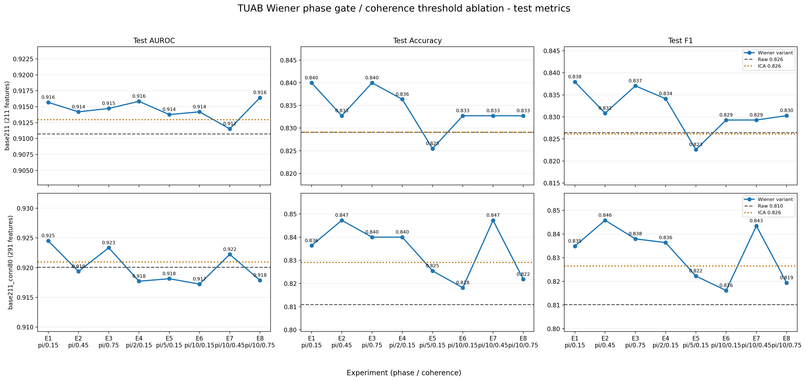
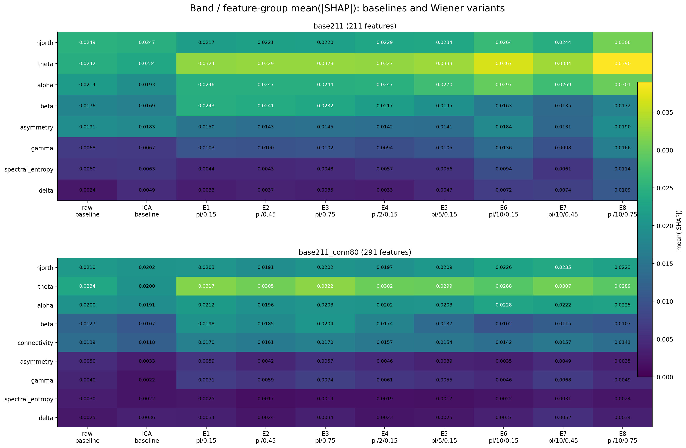
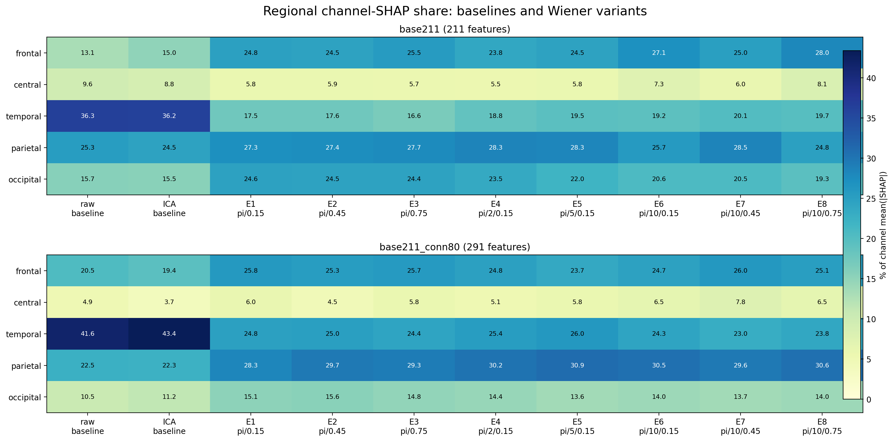
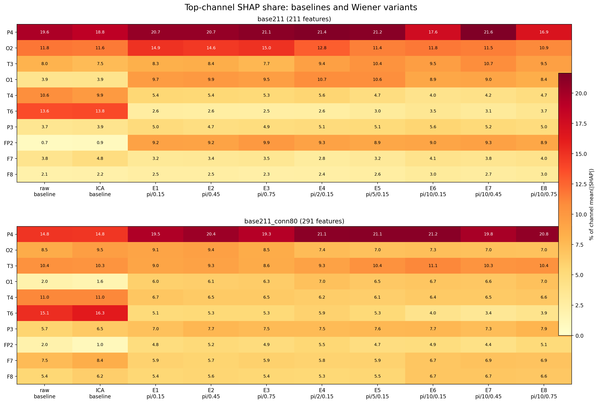

# TUAB Wiener 相位门控 / 相干阈值对照实验总结

**数据源：** `experiments/2026-07-16_024055_*exp1/` 至 `experiments/2026-07-16_024136_*exp8/`  
**生成日期：** 2026-07-16  
**任务：** TUAB abnormal / normal 记录级分类；标签 1 与 `predict_proba[:, 1]` 均表示 normal  
**模型：** XGBoost；同时分析 `base211` 与 `base211_conn80` 两种特征配置  
**指标口径：** 性能图和性能表只使用 **test** 数据；AUROC、Accuracy、F1 均按 recording 聚合，不展示 train/val  

---

## 1. 数据整合与一致性检查

本次更新包含同一 TUAB 测试集上的 8 组 Wiener 参数实验。每个归档都同时包含：

- `base211`：原始 211 维特征，即 171 个单通道统计特征与 40 个半球不对称特征；
- `base211_conn80`：在 `base211` 上增加 80 个半球同源通道对的 coherence / PLV 特征，共 291 维；
- raw、ICA 与当前 Wiener 参数组的 val/test 指标、预测和聚合 SHAP；
- 完整解析配置与数据统计。

8 个归档中的 raw/ICA 指标及 `shap_by_band.json`、`shap_by_channel.json` 均逐字节一致，因此报告将它们视作共享 baseline，不重复平均。测试集在所有实验中也一致：

| 评价单位 | 患者数 | Epoch 数 | Abnormal recording | Normal recording | Abnormal epoch | Normal epoch |
|---:|---:|---:|---:|---:|---:|---:|
| 275 recordings | 252 | 14,833 | 126 | 149 | 6,677 | 8,156 |

需要区分两个概念：患者 ID 用于防止训练/验证泄漏，但 TUAB 标签属于 recording；因此本报告的性能聚合单位是 recording，不是 patient。

---

## 2. 实验变量与参数矩阵

本组实验沿用固定八格设计，只改变两个 Wiener 控制变量：

- `phase_gate_threshold_rad`：零参考硬相位门控。`π` 全部放行，等价于普通 frequency Wiener；阈值越小，只允许越接近零相位的共享成分被移除。
- `coherence_threshold`：组级放行门槛。组内目标频带的最大 pairwise coherence 达到阈值后，该组才进入 Wiener 分解；阈值越高，处理越保守。

| 实验 | Wiener mode | XGBoost condition | 相位阈值 | rad | coherence threshold |
|---|---|---|---|---:|---:|
| exp1 | frequency | wiener | π | 3.142 | 0.15 |
| exp2 | frequency | wiener | π | 3.142 | 0.45 |
| exp3 | frequency | wiener | π | 3.142 | 0.75 |
| exp4 | phasegated | wiener_phasegated | π/2 | 1.571 | 0.15 |
| exp5 | phasegated | wiener_phasegated | π/5 | 0.628 | 0.15 |
| exp6 | phasegated | wiener_phasegated | π/10 | 0.314 | 0.15 |
| exp7 | phasegated | wiener_phasegated | π/10 | 0.314 | 0.45 |
| exp8 | phasegated | wiener_phasegated | π/10 | 0.314 | 0.75 |

---

## 3. Test 性能结果

图中每一行使用独立的局部纵轴，以便看清千分位差异；它不表示这些小差异具有统计显著性。

### 3.1 Baseline

| 特征配置 | 条件 | Test AUROC | Test Accuracy | Test F1 |
|---|---|---:|---:|---:|
| base211 | raw | 0.9107 | 0.8291 | 0.8264 |
| base211 | ICA | 0.9130 | 0.8291 | 0.8261 |
| base211_conn80 | raw | 0.9200 | 0.8109 | 0.8102 |
| base211_conn80 | ICA | 0.9210 | 0.8291 | 0.8264 |

加入 connectivity 后，raw AUROC 从 0.9107 升到 0.9200，ICA AUROC 从 0.9130 升到 0.9210；但 raw 的 F1/Accuracy 同时下降。这说明 connectivity 扩展改善了排序能力，却没有自动改善验证集阈值迁移到 test 后的硬分类结果。

### 3.2 `base211` Wiener 参数组

| 实验 | 相位 | coh | Test AUROC | Test Accuracy | Test F1 | AUROC - raw |
|---|---|---:|---:|---:|---:|---:|
| exp1 | π | 0.15 | 0.9157 | **0.8400** | **0.8379** | +0.0050 |
| exp2 | π | 0.45 | 0.9142 | 0.8327 | 0.8308 | +0.0035 |
| exp3 | π | 0.75 | 0.9147 | **0.8400** | 0.8371 | +0.0040 |
| exp4 | π/2 | 0.15 | 0.9158 | 0.8364 | 0.8341 | +0.0051 |
| exp5 | π/5 | 0.15 | 0.9138 | 0.8255 | 0.8226 | +0.0030 |
| exp6 | π/10 | 0.15 | 0.9142 | 0.8327 | 0.8293 | +0.0035 |
| exp7 | π/10 | 0.45 | 0.9115 | 0.8327 | 0.8293 | +0.0008 |
| exp8 | π/10 | 0.75 | **0.9164** | 0.8327 | 0.8303 | **+0.0057** |

`base211` 下，8 个 Wiener 条件的 AUROC 都高于 raw，但增益只有 +0.0008 至 +0.0057。exp8 的 AUROC 最高，exp1 的 F1 最高，exp1/exp3 的 Accuracy 并列最高，因此不存在一个条件同时占优全部指标。

### 3.3 `base211_conn80` Wiener 参数组

| 实验 | 相位 | coh | Test AUROC | Test Accuracy | Test F1 | AUROC - raw |
|---|---|---:|---:|---:|---:|---:|
| exp1 | π | 0.15 | **0.9245** | 0.8364 | 0.8349 | **+0.0045** |
| exp2 | π | 0.45 | 0.9194 | **0.8473** | **0.8458** | -0.0007 |
| exp3 | π | 0.75 | 0.9234 | 0.8400 | 0.8379 | +0.0033 |
| exp4 | π/2 | 0.15 | 0.9177 | 0.8400 | 0.8364 | -0.0023 |
| exp5 | π/5 | 0.15 | 0.9181 | 0.8255 | 0.8222 | -0.0019 |
| exp6 | π/10 | 0.15 | 0.9172 | 0.8182 | 0.8161 | -0.0028 |
| exp7 | π/10 | 0.45 | 0.9222 | **0.8473** | 0.8434 | +0.0022 |
| exp8 | π/10 | 0.75 | 0.9179 | 0.8218 | 0.8194 | -0.0022 |

`base211_conn80` 下，exp1 的 AUROC 最高，也是全组 16 个“参数 × 特征配置”组合中的最高值；exp2 的 F1 最高，exp2/exp7 的 Accuracy 并列最高。只有 exp1、exp3、exp7 的 AUROC 高于该配置的 raw baseline，说明加入 connectivity 后，Wiener 参数选择对泛化更敏感。

### 3.4 性能层面的直接观察

1. **最稳定的跨配置点是 exp1。** 它在 `base211` 上取得 0.9157 AUROC / 0.8379 F1，在 `base211_conn80` 上取得全组最高的 0.9245 AUROC；两种配置均明显优于各自 raw。
2. **最高 AUROC 与最高 F1 不在同一参数点。** `base211` 的 AUROC 峰值为 exp8，F1 峰值为 exp1；`base211_conn80` 的 AUROC 峰值为 exp1，F1 峰值为 exp2。验证集阈值和概率排序质量必须分开判断。
3. **connectivity 不是无条件增益。** 它提高 raw/ICA 以及 exp1/exp3/exp7 的 AUROC，但在 exp4-exp6、exp8 下反而低于 connectivity raw baseline。
4. **所有 AUROC 差异都很小。** 最大的 Wiener-vs-raw 增益为 +0.0057，且当前只有一个固定 test split、一个随机种子和一套模型训练结果；这些数值更适合描述趋势，不足以单独证明参数优劣。

---

## 4. SHAP 分布总览

SHAP 只能说明分类器在某个预处理和特征配置下依赖哪些输入，不能直接证明某种生理信号被保留或伪迹被删除。以下热力图的列包含共享 raw/ICA baseline 与 exp1-exp8。

### 4.1 频段 / 特征组层面

`shap_by_band.json` 报告的是组内特征的 `mean(|SHAP|)`，不是该组所有特征贡献之和。因此 `base211` 与 `base211_conn80` 的绝对数值不能直接解释成“总信息量”差异；加入 80 个特征后，模型会重新分配每个特征的贡献。

| 特征配置 | baseline 主要特征组 | Wiener 条件中的稳定主轴 |
|---|---|---|
| base211 | raw: Hjorth=0.0249, theta=0.0242, alpha=0.0214 | theta=0.0324–0.0390；alpha=0.0244–0.0301；Hjorth=0.0217–0.0308 |
| base211_conn80 | raw: theta=0.0234, Hjorth=0.0210, alpha=0.0200, connectivity=0.0139 | theta=0.0288–0.0322；alpha=0.0196–0.0228；Hjorth=0.0191–0.0235；connectivity=0.0141–0.0170 |

主要现象如下：

- 所有 Wiener 条件都把 **theta** 推到最高贡献组；`base211` 的 theta 从 raw 的 0.0242 升到 0.0324–0.0390。
- 在 coh=0.15 的相位收紧序列中，`base211` theta 从 exp1 的 0.0324 增至 exp6 的 0.0367，alpha 也从 0.0246 升至 0.0297，但 AUROC 没有随之单调上升。这说明“模型更依赖慢波/节律特征”不等于“分类一定更好”。
- `base211_conn80` 的 connectivity mean(|SHAP|) 在 0.0141–0.0170 之间；exp1/exp3 最高且 AUROC 也较高，但仅凭聚合 SHAP 不能推断 connectivity 是性能增益的因果来源。
- exp8 在 `base211` 中同时出现最高 theta、Hjorth、较高 alpha 与最高 AUROC；同一 exp8 在 `base211_conn80` 中却低于 raw AUROC，进一步说明特征空间与 Wiener 参数存在交互。

### 4.2 脑区层面

脑区数值是各条件 `shap_by_channel.json` 归一化后的相对占比。connectivity 特征会按两个端点各分配一半权重进入通道聚合，因此 `base211_conn80` 的脑区图已经包含 pairwise 特征的端点贡献。

| 特征配置 | raw / ICA 的主要区域 | Wiener 条件区域范围 |
|---|---|---|
| base211 | temporal=36.3% / 36.2%；parietal=25.3% / 24.5% | temporal=16.6–20.1%；parietal=24.8–28.5%；frontal=23.8–28.0%；occipital=19.3–24.6% |
| base211_conn80 | temporal=41.6% / 43.4%；parietal=22.5% / 22.3% | temporal=23.0–26.0%；parietal=28.3–30.9%；frontal=23.7–26.0%；occipital=13.6–15.6% |

两种特征配置给出一致的方向：Wiener 后，模型的相对注意力从 baseline 中占主导的 temporal 区域，迁移到 parietal，并部分迁移到 frontal / occipital。该现象与旧 TUEP 分析中“Wiener 后 temporal 占比升高”不同，说明 SHAP 区域重排具有明显的数据集与任务依赖性，不能把某一数据集的模式当作 Wiener 的普遍生理效应。

### 4.3 关键通道层面

图中 10 个通道由两个特征配置、所有 baseline/Wiener 列的平均占比统一选出，因此两行可以使用同一通道集合比较。

| 变化 | base211 | base211_conn80 |
|---|---|---|
| P4 | raw 19.6% → Wiener 16.9–21.6% | raw 14.8% → Wiener 19.3–21.2% |
| T6 | raw 13.6% → Wiener 2.5–3.7% | raw 15.1% → Wiener 3.4–5.9% |
| T4 | raw 10.6% → Wiener 4.0–5.6% | raw 11.0% → Wiener 6.1–6.7% |
| O1 | raw 3.9% → Wiener 8.4–10.7% | raw 2.0% → Wiener 6.0–7.0% |
| FP2 | raw 0.7% → Wiener 8.9–9.9% | raw 2.0% → Wiener 4.4–5.5% |

P4 是所有 Wiener 条件中最稳定的高贡献通道。与此同时，T6/T4 的相对占比显著下降，O1/FP2 上升，这正是区域图中 temporal 下降、parietal/occipital/frontal 上升的通道级来源。

这类变化有两种都合理的解释：Wiener 可能减少了颞链共享成分，使其他区域的判别信息更突出；也可能删去了部分有用的颞区生理信息，使模型转向替代特征。仅靠 SHAP 不能在二者之间作出判决，必须结合直接波形、相干性变化、伪迹标注或 ERP 指标。

---

## 5. 两个控制变量的交互

### 5.1 固定 `phase=π`，提高 coherence threshold

exp1-exp3 对应 coh=0.15、0.45、0.75：

- `base211` AUROC 为 0.9157 → 0.9142 → 0.9147，范围仅 0.0015，没有单调趋势；
- `base211_conn80` AUROC 为 0.9245 → 0.9194 → 0.9234，低阈值最好，中间阈值下降，高阈值回升。

因此，提高 coherence threshold 并不会稳定改善泛化。当前 gate 使用目标频带内的最大 coherence，只要存在一个强相干点就会放行整个组；不同阈值改变哪些组被处理后，可能同时改变伪迹残留与有效背景信息。

### 5.2 固定 `coh=0.15`，收紧 phase gate

exp1、exp4、exp5、exp6 对应 phase=π、π/2、π/5、π/10：

- `base211` AUROC 为 0.9157 → 0.9158 → 0.9138 → 0.9142，变化很小且不单调；
- `base211_conn80` AUROC 为 0.9245 → 0.9177 → 0.9181 → 0.9172，普通 frequency Wiener 明显高于三个严格门控条件。

在当前 TUAB connectivity 特征空间中，严格相位门控没有带来更高 AUROC。一个可能解释是：非零相位的组间可预测成分仍携带与 abnormal/normal 分类相关的信息；另一个可能解释是，严格门控保留了更多残余伪迹。由于分类性能只是间接去噪指标，当前结果无法区分两者。

### 5.3 固定 `phase=π/10`，提高 coherence threshold

exp6-exp8 对应 coh=0.15、0.45、0.75：

- `base211` AUROC 为 0.9142 → 0.9115 → 0.9164，高阈值最好；
- `base211_conn80` AUROC 为 0.9172 → 0.9222 → 0.9179，中阈值最好。

相同 Wiener 参数在两个特征配置中出现不同最优点，说明 `phase_gate_threshold`、`coherence_threshold` 与下游特征空间存在交互，不能只根据单一 profile 得出“中等/高 coherence threshold 更好”的一般结论。

---

## 6. 结论

- **观察到的最高 Test AUROC：** exp1 + `base211_conn80`，即 frequency Wiener、`phase=π`、`coh=0.15`，AUROC=0.9245，比同 profile raw 高 0.0045。
- **`base211` 的最高 Test AUROC：** exp8，AUROC=0.9164；但它的 F1/Accuracy 不如 exp1，说明 AUROC 与阈值指标的偏好不同。
- **最一致的跨 profile 参数：** exp1。它在两个 profile 中都高于各自 raw，且在 `base211` 中取得最高 F1、在 `base211_conn80` 中取得最高 AUROC。若只根据这批下游结果选择一个后续复核对象，exp1 是最稳妥的候选。
- **connectivity 的作用具有条件性：** `base211_conn80` 提高 baseline 及 exp1/exp3/exp7 的 AUROC，却没有让所有 Wiener 参数都受益。它放大了参数选择的重要性。
- **SHAP 重排：** Wiener 后模型从 T4/T6 主导的 temporal 模式，转向 P4、O1/O2、FP2 及 theta/alpha 相关特征。该变化证明模型表征发生了系统性迁移，但不能单独证明去噪保留或删除了生理信号。
- **本结果仍是下游效用证据，不是直接去噪证据。** Wiener 的科学目标是移除共享物理/伪迹成分并保留局部脑电；是否真正做到这一点，还需要 ERP-CORE 波形保持、SNR、baseline noise、峰值幅度/潜伏期等直接指标共同验证。

---

## 7. 局限与下一步

1. **不可把 test 最大值当作无偏模型选择结果。** 本报告为了与旧报告保持一致，统一展示 test；但在 8 个参数上反复比较 test 会产生选择偏差。正式确定参数时应先在 val 或嵌套 CV 中选择，再对锁定的 test 只评估一次。
2. **缺少不确定性估计。** 目前只有一个 split 和一个随机种子，AUROC 差异均小于 0.006。下一步应进行按 recording 配对的 bootstrap/DeLong 比较，并用多随机种子复训检查稳定性。
3. **SHAP 是相对模型解释，不是信号幅度。** 脑区和通道图在每个条件内归一化；某通道占比下降可能来自自身贡献下降，也可能来自其他通道贡献上升。
4. **feature-group mean 不能跨维度直接当作总贡献。** `base211_conn80` 多出 80 个 connectivity 特征，组内 mean(|SHAP|) 与 211 维 profile 的绝对值只适合辅助比较。
5. **缺少 Wiener 处理强度记录。** 当前归档没有按 recording 汇总实际处理/跳过的通道组、coherence gate 命中率及 RMS 变化，难以把参数变化映射到真实去噪强度。
6. **建议的下一步：** 归档每组 gate 命中统计和直接信号变化；对 exp1、exp8 及 raw/ICA 做配对置信区间；再与 ERP-CORE 的直接去噪指标并列报告，避免仅凭分类与 SHAP 判断生理保真度。
