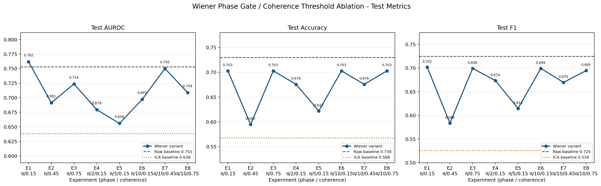
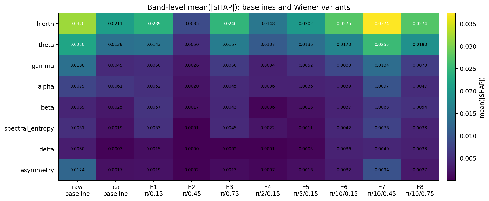
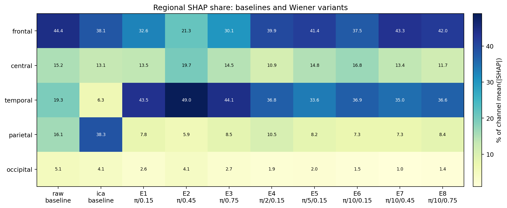
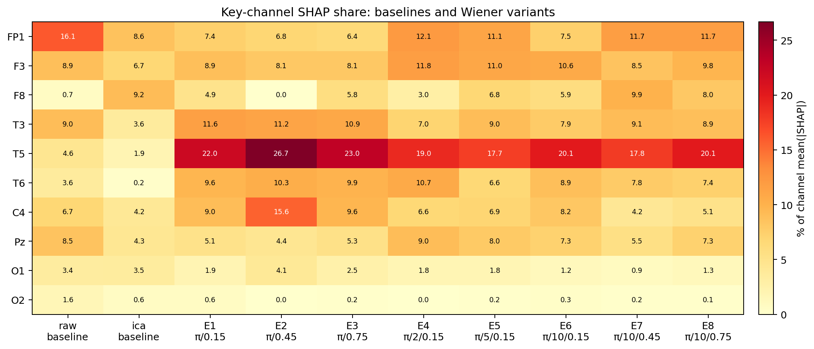

# Wiener 相位门控 / 相干阈值对照实验总结

**数据源：** `experiments/2026-07-09_*_wiener-phase-exp{1..8}/`
**生成日期：** 2026-07-09
**模型：** XGBoost + 211 维手工特征
**指标口径：** 本报告性能图和性能表仅使用 **test** 数据；不展示 train/val。

---

## 1. 实验变量与参数矩阵

本组实验围绕两个 Wiener 控制变量展开：

- `phase_gate_threshold_rad`：相位门控阈值。`π` 等价于 frequency 方法，不限制相位；阈值越小，越只允许近零相位的共享成分被移除。
- `coherence_threshold`：组级相干性门槛。只有通道组内任意 pair 在目标频带中的最大 coherence 达到该阈值，整个组才进入 Wiener 分解；阈值越高，降噪越保守。

| 实验 | 方法 | XGBoost condition | 相位阈值 | rad | coherence threshold |
|---|---|---|---|---|---|
| exp1 | frequency | wiener | π | 3.142 | 0.15 |
| exp2 | frequency | wiener | π | 3.142 | 0.45 |
| exp3 | frequency | wiener | π | 3.142 | 0.75 |
| exp4 | phasegated | wiener_phasegated | π/2 | 1.571 | 0.15 |
| exp5 | phasegated | wiener_phasegated | π/5 | 0.628 | 0.15 |
| exp6 | phasegated | wiener_phasegated | π/10 | 0.314 | 0.15 |
| exp7 | phasegated | wiener_phasegated | π/10 | 0.314 | 0.45 |
| exp8 | phasegated | wiener_phasegated | π/10 | 0.314 | 0.75 |

---

## 2. Test 性能结果

### Baseline

| 条件 | Test AUROC | Test Accuracy | Test F1 |
|---|---|---|---|
| raw | 0.7529 | 0.7297 | 0.7247 |
| ica | 0.6382 | 0.5676 | 0.5256 |

### Wiener 参数组

| 实验 | 相位阈值 | coh | Test AUROC | Test Accuracy | Test F1 | AUROC - raw |
|---|---|---|---|---|---|---|
| exp1 | π | 0.15 | 0.7618 | 0.7027 | 0.7018 | 0.0088 |
| exp2 | π | 0.45 | 0.6912 | 0.5946 | 0.5836 | -0.0618 |
| exp3 | π | 0.75 | 0.7235 | 0.7027 | 0.6992 | -0.0294 |
| exp4 | π/2 | 0.15 | 0.6794 | 0.6757 | 0.6735 | -0.0735 |
| exp5 | π/5 | 0.15 | 0.6559 | 0.6216 | 0.6146 | -0.0971 |
| exp6 | π/10 | 0.15 | 0.6971 | 0.7027 | 0.6992 | -0.0559 |
| exp7 | π/10 | 0.45 | 0.7500 | 0.6757 | 0.6696 | -0.0029 |
| exp8 | π/10 | 0.75 | 0.7088 | 0.7027 | 0.6947 | -0.0441 |

**直接观察：**

- 最好的 Wiener 条件是 **exp1**：`phase=π`, `coh=0.15`，Test AUROC=0.7618，略高于 raw baseline 的 0.7529。
- 在最严格相位门控 `π/10` 组内，表现最好的是 **exp7**：`coh=0.45`，Test AUROC=0.7500，接近 raw baseline。
- ICA baseline 明显低于 raw 和多数 Wiener 条件，提示仅用 ICA 去除额部代理相关成分，并不能充分覆盖当前数据中的判别性伪迹/背景差异。

---

## 3. SHAP 分布总览

### 3.1 频段层面

上图左侧两列加入 raw 与 ICA baseline，后续列为 exp1-exp8 的 Wiener 条件，便于直接观察预处理前后模型注意力如何迁移。

| 实验 | 相位 | coh | 总 mean(\|SHAP\|) | 前三频段 |
|---|---|---|---|---|
| exp1 | π | 0.15 | 0.06278 | hjorth=0.0239, theta=0.0143, beta=0.0057 |
| exp2 | π | 0.45 | 0.02019 | hjorth=0.0085, theta=0.0050, gamma=0.0026 |
| exp3 | π | 0.75 | 0.06166 | hjorth=0.0246, theta=0.0157, gamma=0.0066 |
| exp4 | π/2 | 0.15 | 0.03616 | hjorth=0.0148, theta=0.0107, alpha=0.0036 |
| exp5 | π/5 | 0.15 | 0.04759 | hjorth=0.0202, theta=0.0136, gamma=0.0052 |
| exp6 | π/10 | 0.15 | 0.07153 | hjorth=0.0275, theta=0.0170, gamma=0.0083 |
| exp7 | π/10 | 0.45 | 0.11337 | hjorth=0.0374, theta=0.0255, gamma=0.0134 |
| exp8 | π/10 | 0.75 | 0.07325 | hjorth=0.0274, theta=0.0190, gamma=0.0070 |

频段上，所有 Wiener 条件都以 **Hjorth** 和 **theta** 为主要贡献来源。Hjorth 描述背景信号的方差、平均频率和复杂度；theta 则更接近临床 EEG 中背景慢化、颞区节律性慢波和觉醒状态差异可能出现的位置。这里的 gamma 仅为 30-40 Hz，和肌电频段有重叠，不能解释为高频振荡类癫痫生物标志物。

### 3.2 脑区层面

上图左侧两列为 raw/ICA baseline 的脑区占比，后续列为 Wiener 参数组。

| 实验 | 相位 | coh | SHAP 占比最高脑区 |
|---|---|---|---|
| exp1 | π | 0.15 | temporal=43.5%, frontal=32.6% |
| exp2 | π | 0.45 | temporal=49.0%, frontal=21.3% |
| exp3 | π | 0.75 | temporal=44.1%, frontal=30.1% |
| exp4 | π/2 | 0.15 | frontal=39.9%, temporal=36.8% |
| exp5 | π/5 | 0.15 | frontal=41.4%, temporal=33.6% |
| exp6 | π/10 | 0.15 | frontal=37.5%, temporal=36.9% |
| exp7 | π/10 | 0.45 | frontal=43.3%, temporal=35.0% |
| exp8 | π/10 | 0.75 | frontal=42.0%, temporal=36.6% |

raw baseline 的脑区 SHAP 占比为：frontal=44.4%, temporal=19.3%, central=15.2%, parietal=16.1%, occipital=5.1%。ICA baseline 为：frontal=38.1%, temporal=6.3%, central=13.1%, parietal=38.3%, occipital=4.1%。

Wiener 条件中，temporal 区域在 exp1-exp3 中占比最高，尤其是 T5/T3/T6。相位门控收紧后，frontal 占比明显回升，说明更严格的相位门控虽然更保守，但也可能让额部残余伪迹或额区真实背景活动重新进入模型判别依据。

### 3.3 关键通道层面

上图左侧两列为 raw/ICA baseline，后续列为 Wiener 参数组，数值为关键通道在通道级 mean(|SHAP|) 中的占比。

| 实验 | 相位 | coh | 关键通道 Top SHAP 占比 |
|---|---|---|---|
| exp1 | π | 0.15 | T5=22.0%, T3=11.6%, T6=9.6%, C4=9.0% |
| exp2 | π | 0.45 | T5=26.7%, C4=15.6%, T3=11.2%, T6=10.3% |
| exp3 | π | 0.75 | T5=23.0%, T3=10.9%, T6=9.9%, C4=9.6% |
| exp4 | π/2 | 0.15 | T5=19.0%, FP1=12.1%, F3=11.8%, T6=10.7% |
| exp5 | π/5 | 0.15 | T5=17.7%, FP1=11.1%, F3=11.0%, T3=9.0% |
| exp6 | π/10 | 0.15 | T5=20.1%, F3=10.6%, T6=8.9%, C4=8.2% |
| exp7 | π/10 | 0.45 | T5=17.8%, FP1=11.7%, F8=9.9%, T3=9.1% |
| exp8 | π/10 | 0.75 | T5=20.1%, FP1=11.7%, F3=9.8%, T3=8.9% |

raw baseline 的 top 通道为：FP1=16.1%, F7=10.4%, T3=9.0%, F3=8.9%, Pz=8.5%。ICA baseline 的 top 通道为：P3=31.3%, F8=9.2%, FP1=8.6%, F3=6.7%, Fz=6.0%。Wiener 后，T5 在所有参数组里都是关键通道之一，提示当前分类器主要利用左颞后链附近的背景形态/慢波相关特征，而不是单纯依赖枕区或额极。

---

## 4. 两个变量的可解释性

### 4.1 `phase_gate_threshold`：控制“什么相位关系可以被当作可移除共享成分”

`phase=π` 时，phase gate 等于全通过，frequency Wiener 会移除任意相位的组内可预测共享成分。这是最激进的设置：它对肌电/运动伪迹的去除召回率最高，但也最可能把具有非零相位延迟的真实神经耦合一并回归掉。

本次结果中，`phase=π, coh=0.15` 的 exp1 反而是 Test AUROC 最高的设置，而且 temporal SHAP 占比达到 43.5%，T5/T3/T6 位于前列。因此，**本次 SHAP 分布不支持“frequency Wiener 把颞区生理性信号整体消除”这个强结论**。更温和的表述是：frequency 确实有误删非零相位神经耦合的理论风险，但在这批结果中，模型仍保留并使用了大量颞区 Hjorth/theta 相关信息。

随着相位阈值从 `π/2` 收紧到 `π/5`、`π/10`，算法只允许越来越接近零相位的共享成分被去除。按物理假设，这更贴近容积传导和肌电伪迹近零相位的特征，也更保守。但本次 SHAP 结果显示，严格门控并没有带来更清晰的“生理信号暴露”：frontal/FP1/F8/F3 的贡献反而回升。这提示：**过严相位门控可能保留了一部分额部残余信号**。这些残余信号可能是额肌/眼动伪迹，也可能包含额区真实背景活动；仅凭聚合 SHAP 无法区分二者。

### 4.2 `coherence_threshold`：控制“哪些通道组有资格被处理”

`coherence_threshold` 是组级 gate。阈值越高，越少通道组进入 Wiener 分解，降噪越保守。需要注意，当前代码取的是目标频带内 pairwise coherence 的最大值，不是平均值；因此它更像一个“是否存在强相干点”的放行条件。

在 `phase=π` 组内，coh 从 0.15 提高到 0.45 后 Test AUROC 从 0.7618 降到 0.6912，coh=0.75 又回升到 0.7235。这不是单调关系，说明单纯提高相干阈值并不自动改善泛化。可能原因是：较高阈值让部分伪迹通道组跳过处理，造成“有些组被清理、有些组保留”的不均匀状态；也可能因为不同阈值改变了下游特征相关结构，XGBoost 的 SHAP 分配随之重排。

在 `phase=π/10` 组内，coh=0.45 的 exp7 最接近 raw baseline，优于 coh=0.15 和 0.75。这个形状支持一个实用解释：**严格相位门控需要搭配中等相干阈值**。阈值过低时，太多弱相干组被处理，可能引入不稳定的过清理；阈值过高时，太多组被跳过，伪迹残留增加。coh=0.45 在本批实验中提供了更平衡的位置。

---

## 5. 从 SHAP 变化推断生理性信号是否被消除

本报告不把 SHAP 当作直接的生理信号测量。SHAP 只能说明模型在某个预处理条件下更依赖哪些特征；它不能直接证明某个脑电成分被真实删除。但结合代码机制和 EEG 生理知识，可以得到几个谨慎推断：

1. **颞区生理性信号没有被整体消除。** exp1-exp3 的 temporal SHAP 占比最高，T5/T3/T6 是主要通道，Hjorth/theta 是主要特征组。这与颞叶背景异常、TIRDA 样慢波或颞区背景组织性差异的方向一致。即便是最激进的 `phase=π` frequency 方法，仍保留了模型可利用的颞区信息。

2. **严格相位门控不必然更“生理”。** `π/10` 的物理假设更保守，但 SHAP 显示 frontal 贡献增加，尤其 exp7/exp8 中 FP1/F8/F3 占比回升。若这些额区特征主要来自伪迹，则严格相位门控会保留更多伪迹；若它们来自额区真实背景活动，则严格相位门控保留了生理信号。当前缺少专家标注和 V1/V2/V3 验证，不能二者择一。

3. **枕区/PDR 不是本次模型的主要解释来源。** O1/O2 在 8 个 Wiener 条件中的占比都较低，说明本次参数对照没有形成“枕区信号暴露”的主导模式。若后头部优势节律是重要生理机制，它可能没有被当前 211 维特征充分捕获，也可能在此任务中不是最强判别源。

4. **Hjorth + theta 是最稳定的生理解释轴。** 各实验都依赖 Hjorth 和 theta，说明模型主要关注背景形态、复杂度和慢波/低频节律，而不是高频或单一不对称性特征。这比单纯依赖 FP1/FP2 更接近临床 EEG 对背景组织性的判读方式。

---

## 6. 结论

- **最佳 Test AUROC：** exp1 (`phase=π`, `coh=0.15`, frequency)，略高于 raw baseline。它说明在当前数据和特征空间里，最激进的 frequency Wiener 并未明显破坏模型可用的颞区信息。
- **最可解释的折中点：** exp7 (`phase=π/10`, `coh=0.45`) 接近 raw AUROC，且代表“严格相位门控 + 中等相干阈值”的保守方案。但它的 frontal SHAP 较高，需警惕额部伪迹残留。
- **变量解释：** `phase_gate_threshold` 主要调节“非零相位神经耦合被误删”与“额部/肌电残余被保留”的权衡；`coherence_threshold` 主要调节“哪些通道组被处理”的保守程度。两者不是线性独立变量，组合效果需要用性能和 SHAP 一起判断。
- **生理性信号消除判断：** 本次结果不支持“Wiener 一定消除生理性信号”的强结论；更准确的说法是：frequency 有理论误删风险，但当前 SHAP 仍显示颞区背景相关信息被保留；严格相位门控减少误删风险的同时，也可能增加额部残余信号。

## 7. 局限与下一步

- 本报告使用的是聚合 SHAP JSON，不是逐 epoch SHAP 分布，也没有专家标注伪迹/生理事件标签。
- 当前实验没有归档 `skipped_pairs`，无法知道每个阈值下具体哪些通道组被跳过。
- 当前 211 维特征缺少 connectivity/PLV/coherence 特征，无法直接验证“相位门控是否保留了非零相位神经耦合”。
- 下一步建议同时归档 V1 coherence 变化、`skipped_pairs` 统计，并接入 connectivity 特征，以直接检验相位门控是否在保护真实神经耦合。
