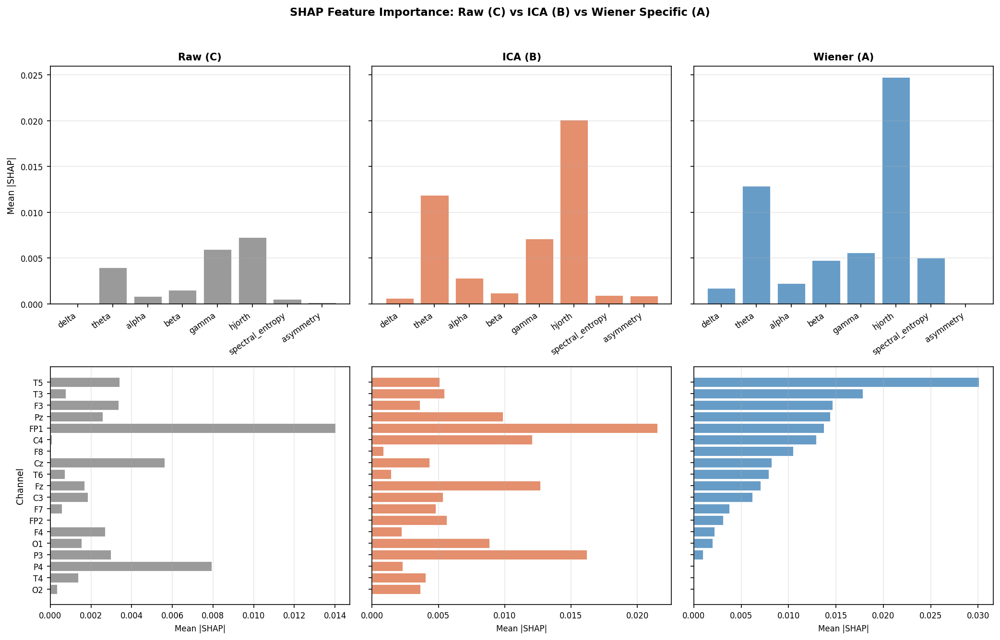
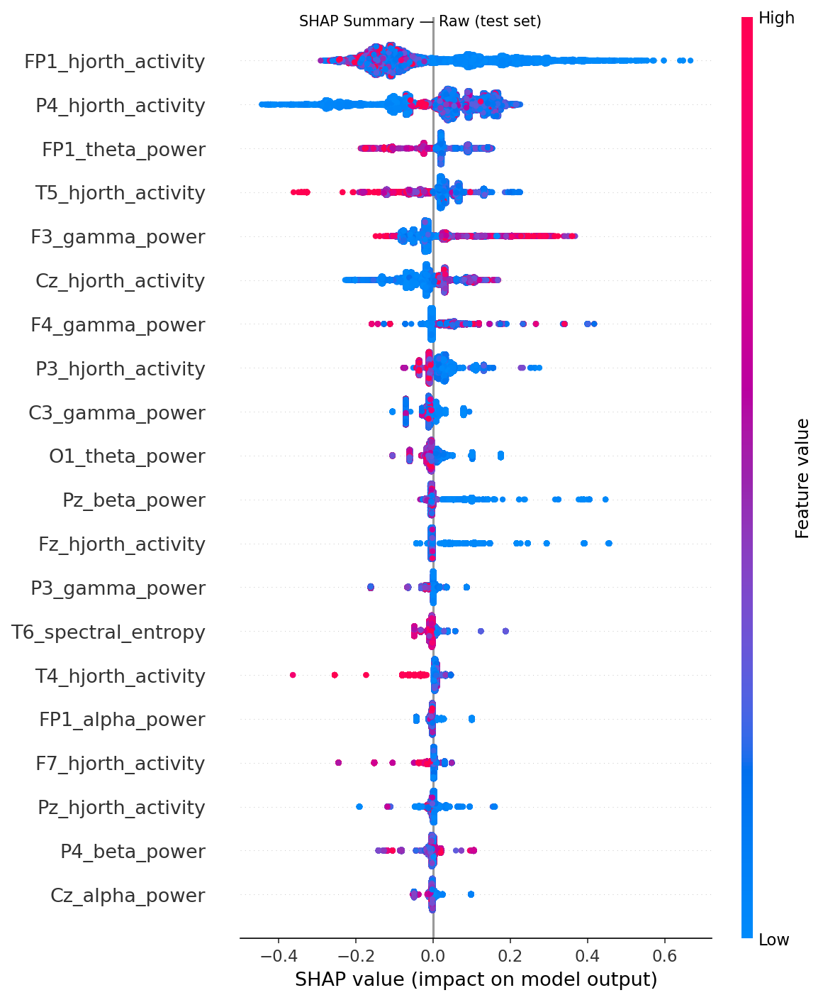
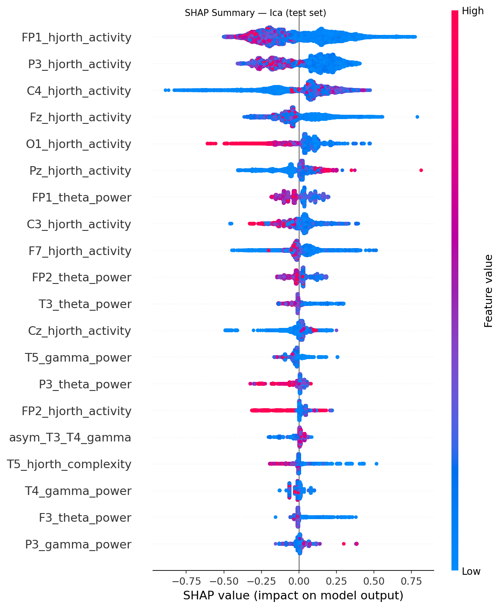
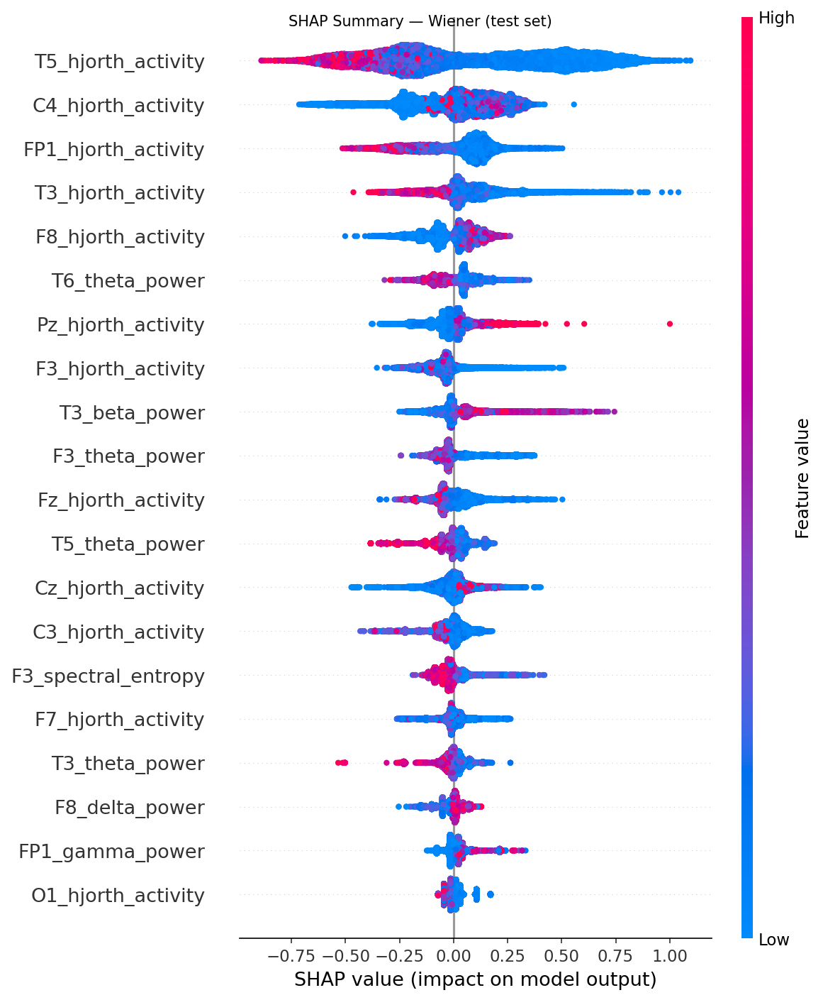

# Experiment: 2026-05-28_001831_wiener-ar

**Date:** 2026-05-28 00:18:31  
**Config:** configs/local.yaml  
**Conditions found:** raw, ica, wiener

## Configuration Snapshot

| Parameter | Value |
|---|---|
| `target_sfreq` | 125 |
| `bandpass` | [0.5, 40.0] |
| `epoch_length_sec` | 8.0 |
| `artifact_threshold_uv` | 200.0 |
| `seizure_buffer_sec` | 30.0 |
| `split.train` | 0.7 |
| `split.val` | 0.1 |
| `split.test` | 0.2 |
| `split.random_seed` | 42 |
| `wiener.mode` | frequency |
| `wiener.nperseg` | 250 |
| `wiener.freq_resolution_hz` | 0.5 |
| `wiener.coherence_threshold` | 0.15 |
| `ica.n_components` | 19 |
| `ica.artifact_corr_threshold` | 0.8 |
| `ml.cv_folds` | 5 |
| `ml.early_stopping_rounds` | 30 |
| `ml.param_grid` | {"max_depth": [3, 4, 5, 6], "learning_rate": [0.01, 0.05, 0.1, 0.3], "n_estimators": [100, 200, 500], "subsample": [0.8, 1.0], "colsample_bytree": [0.8, 1.0], "reg_alpha": [0.0, 0.1], "reg_lambda": [1.0, 5.0]} |

## Results Summary

| Condition | Val AUROC | Val F1 | Val Acc | Test AUROC | Test F1 | Test Acc |
|---|---|---|---|---|---|---|
| raw | 0.528 | 0.530 | 0.588 | 0.685 | 0.401 | 0.486 |
| ica | 0.500 | 0.564 | 0.588 | 0.676 | 0.540 | 0.568 |
| wiener | 0.625 | 0.702 | 0.706 | 0.718 | 0.590 | 0.595 |

## SHAP Comparison

## Per-Condition SHAP Summaries

### Raw

### Ica

### Wiener

