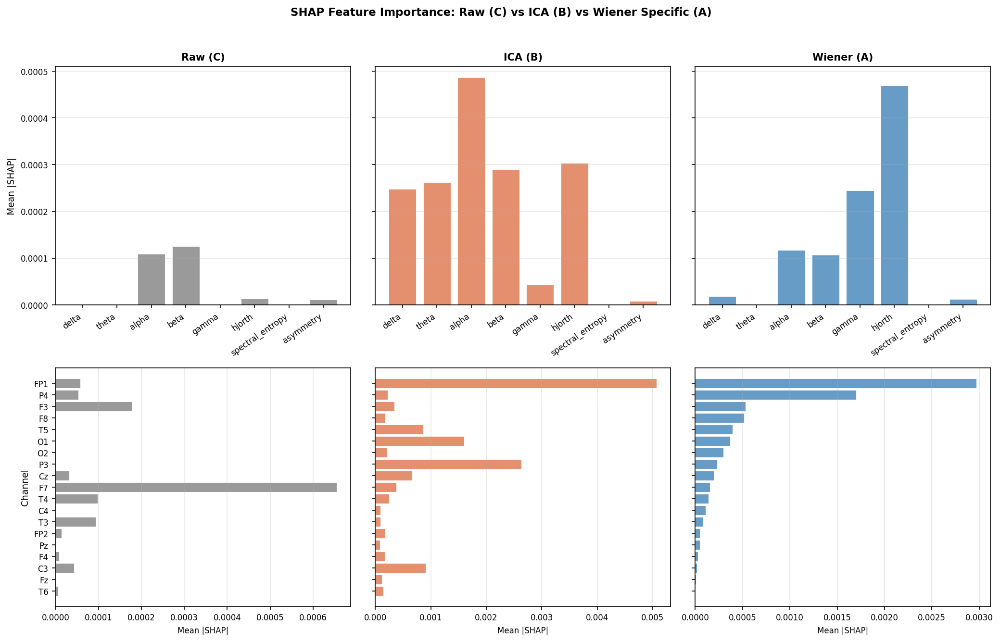
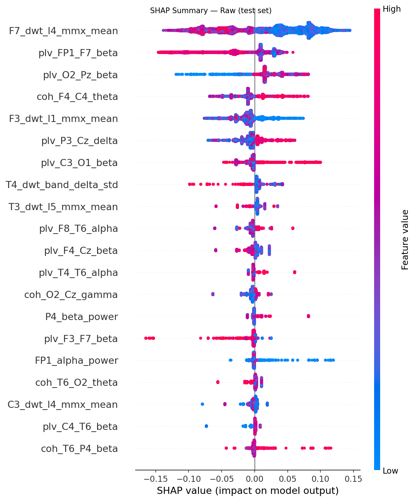
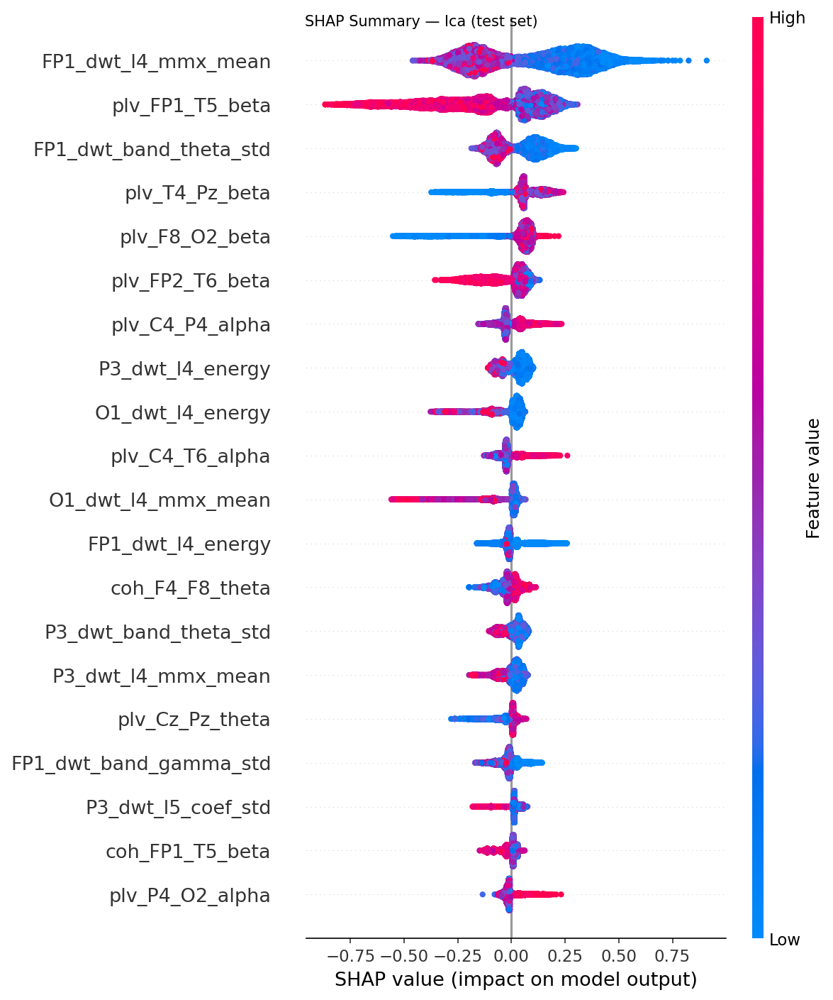
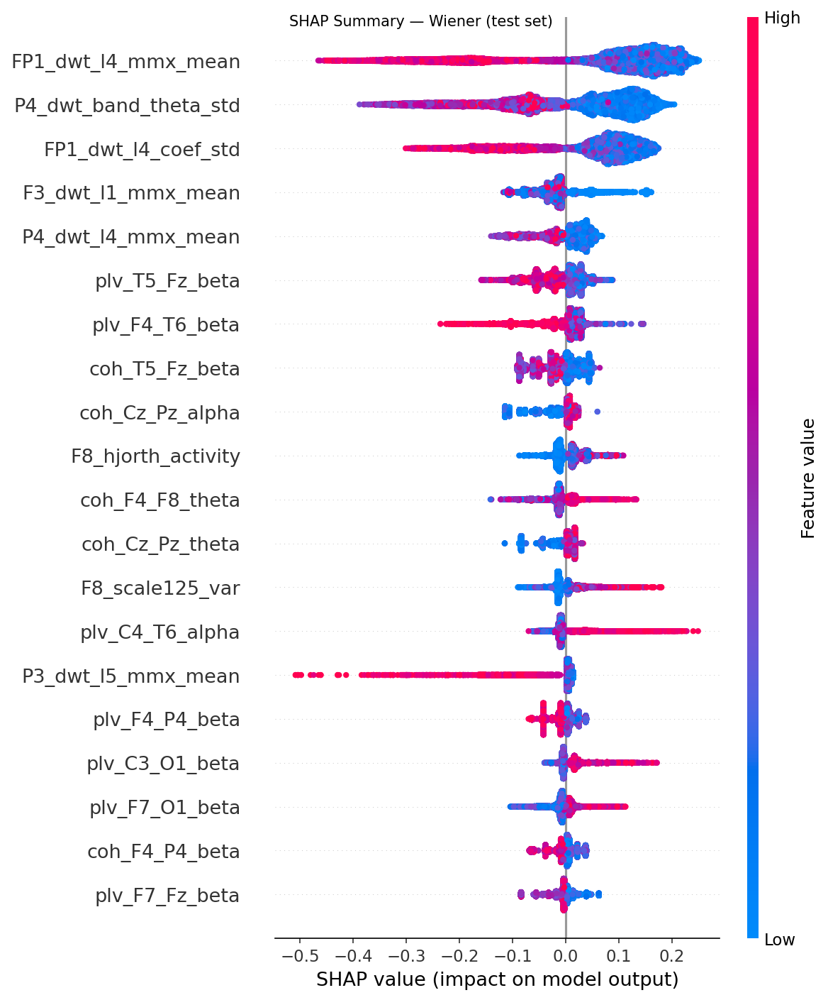

# Experiment: 2026-06-13_125202_exp_chgroups_2_chgroups-2

**Date:** 2026-06-13 12:52:02  
**Config:** configs/exp_chgroups_2.yaml  
**Conditions found:** raw, ica, wiener

## Configuration Snapshot

| Parameter | Value |
|---|---|
| `target_sfreq` | 125 |
| `bandpass` | [0.5, 40.0] |
| `epoch_length_sec` | 8.0 |
| `artifact_threshold_uv` | 200.0 |
| `seizure_buffer_sec` | 30.0 |
| `split.train` | 0.7 |
| `split.val` | 0.1 |
| `split.test` | 0.2 |
| `split.random_seed` | 42 |
| `wiener.mode` | frequency |
| `wiener.nperseg` | 250 |
| `wiener.freq_resolution_hz` | 0.5 |
| `wiener.coherence_threshold` | 0.15 |
| `ica.n_components` | 19 |
| `ica.artifact_corr_threshold` | 0.8 |
| `ml.cv_folds` | 3 |
| `ml.early_stopping_rounds` | 30 |
| `ml.param_grid` | {"max_depth": [4, 6], "learning_rate": [0.05, 0.1], "subsample": [0.8], "colsample_bytree": [0.8], "reg_alpha": [0.0], "reg_lambda": [1.0]} |

## XGBoost Results Summary

| Condition | Val AUROC | Val F1 | Val Acc | Test AUROC | Test F1 | Test Acc |
|---|---|---|---|---|---|---|
| raw | 0.611 | 0.646 | 0.647 | 0.776 | 0.695 | 0.703 |
| ica | 0.597 | 0.646 | 0.647 | 0.744 | 0.730 | 0.730 |
| wiener | 0.528 | 0.614 | 0.647 | 0.644 | 0.552 | 0.568 |

## Dataset Statistics

| Split | Subjects | Epochs | Epilepsy Subj | Control Subj | Epilepsy Ep | Control Ep |
|---|---|---|---|---|---|---|
| train | 124 | 149224 | 67 | 57 | 119443 | 29781 |
| val | 17 | 5526 | 9 | 8 | 3811 | 1715 |
| test | 37 | 26346 | 20 | 17 | 21952 | 4394 |

## SHAP Comparison

## Per-Condition SHAP Summaries

### Raw

### Ica

### Wiener

