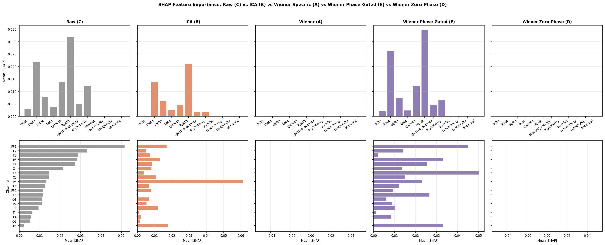
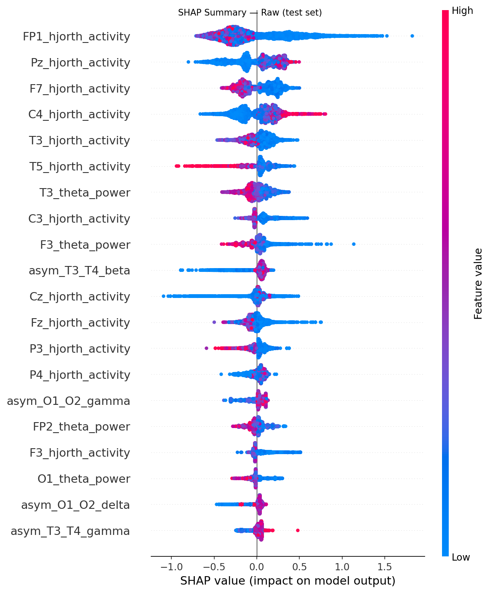
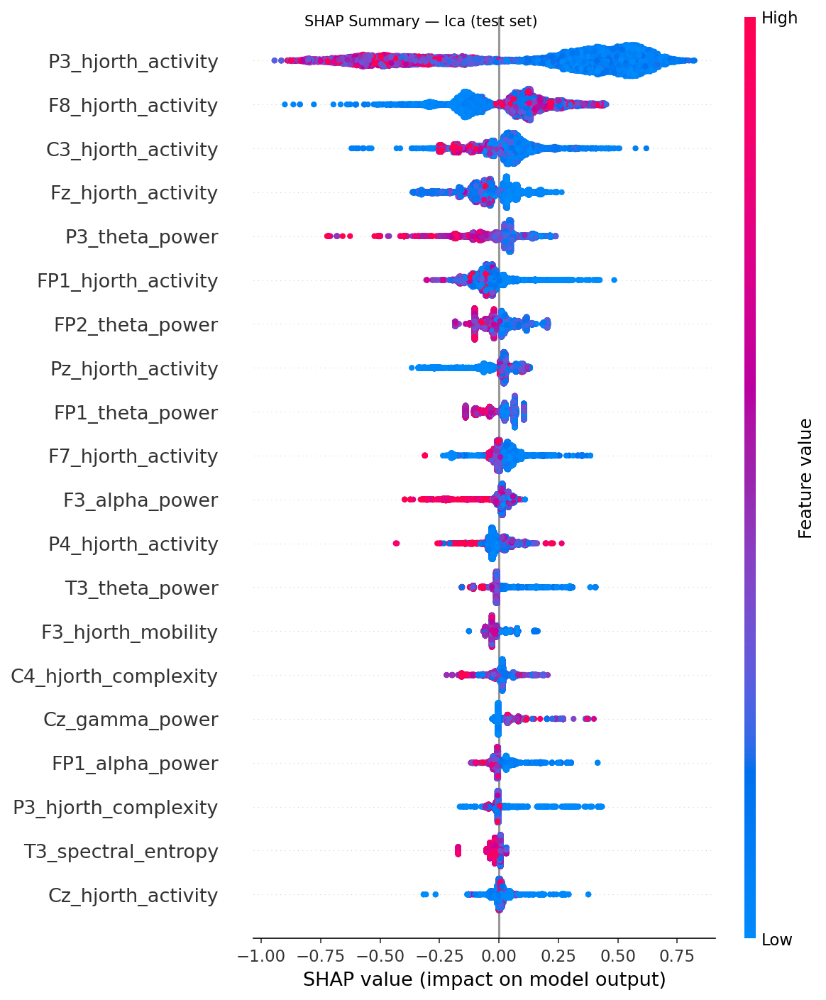
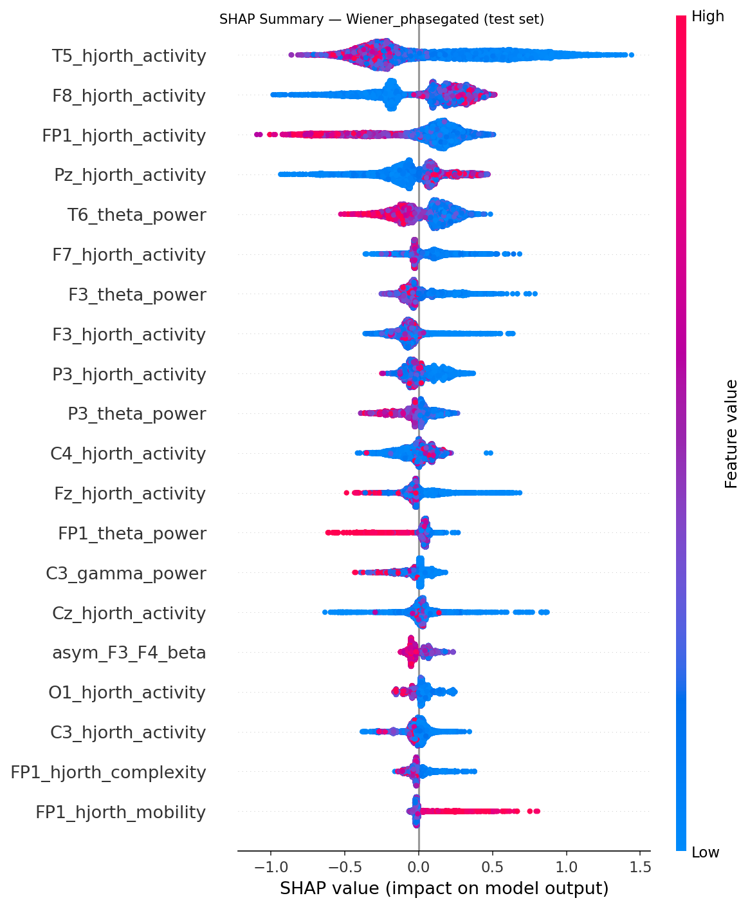

# Experiment: 2026-07-10_175305_exp_wiener_phase_4_wiener-phase-exp4

**Date:** 2026-07-10 17:53:05  
**Config:** configs/exp_wiener_phase_4.yaml  
**Conditions found:** raw, ica, wiener_phasegated

## Configuration Snapshot

| Parameter | Value |
|---|---|
| `target_sfreq` | 125 |
| `bandpass` | [0.5, 40.0] |
| `epoch_length_sec` | 20.0 |
| `artifact_threshold_uv` | 200.0 |
| `seizure_buffer_sec` | 30.0 |
| `split.train` | 0.7 |
| `split.val` | 0.1 |
| `split.test` | 0.2 |
| `split.random_seed` | 42 |
| `wiener.mode` | phasegated |
| `wiener.nperseg` | 500 |
| `wiener.freq_resolution_hz` | 0.5 |
| `wiener.coherence_threshold` | 0.15 |
| `wiener.phase_gate_threshold_rad` | 1.5707963267948966 |
| `ica.n_components` | 19 |
| `ica.artifact_corr_threshold` | 0.8 |
| `ml.cv_folds` | 5 |
| `ml.early_stopping_rounds` | 30 |
| `ml.param_grid` | {"max_depth": [3, 4, 5, 6], "learning_rate": [0.01, 0.05, 0.1, 0.3], "n_estimators": [100, 200, 500], "subsample": [0.8, 1.0], "colsample_bytree": [0.8, 1.0], "reg_alpha": [0.0, 0.1], "reg_lambda": [1.0, 5.0]} |

## XGBoost Results Summary

| Condition | Val AUROC | Val F1 | Val Acc | Test AUROC | Test F1 | Test Acc |
|---|---|---|---|---|---|---|
| raw | 0.569 | 0.588 | 0.588 | 0.753 | 0.725 | 0.730 |
| ica | 0.528 | 0.614 | 0.647 | 0.638 | 0.526 | 0.568 |
| wiener_phasegated | 0.667 | 0.764 | 0.765 | 0.762 | 0.702 | 0.703 |

## Dataset Statistics

| Split | Subjects | Epochs | Epilepsy Subj | Control Subj | Epilepsy Ep | Control Ep |
|---|---|---|---|---|---|---|
| train | 124 | 54592 | 67 | 57 | 43404 | 11188 |
| val | 17 | 2063 | 9 | 8 | 1407 | 656 |
| test | 37 | 9343 | 20 | 17 | 7707 | 1636 |

## SHAP Comparison

## Per-Condition SHAP Summaries

### Raw

### Ica

### Wiener_phasegated

