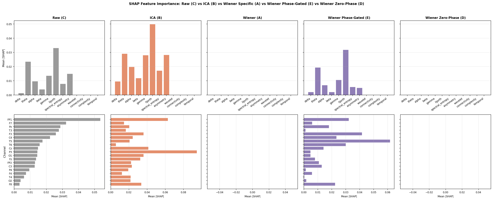
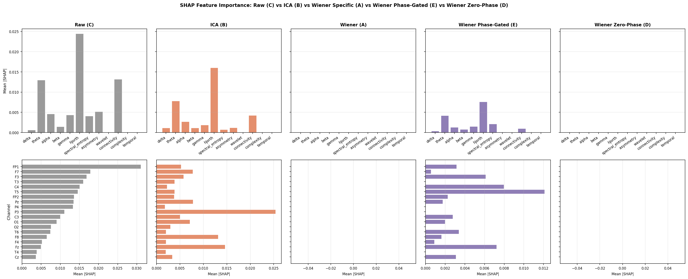
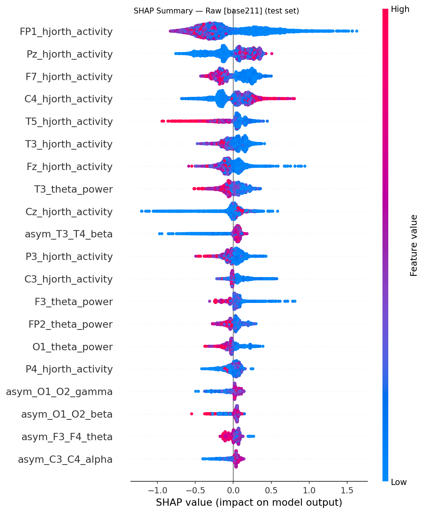
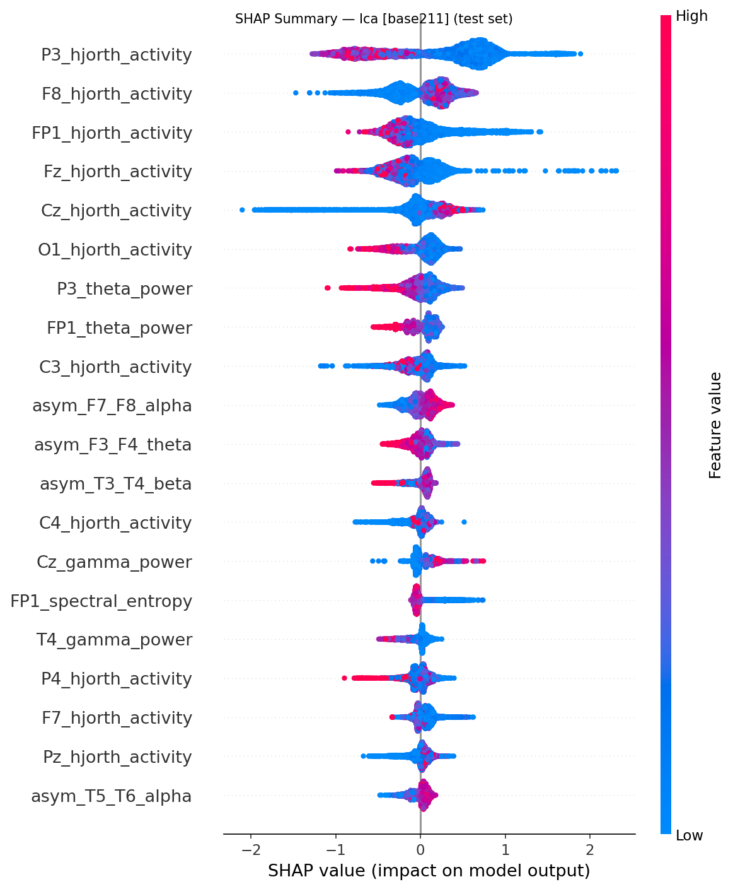
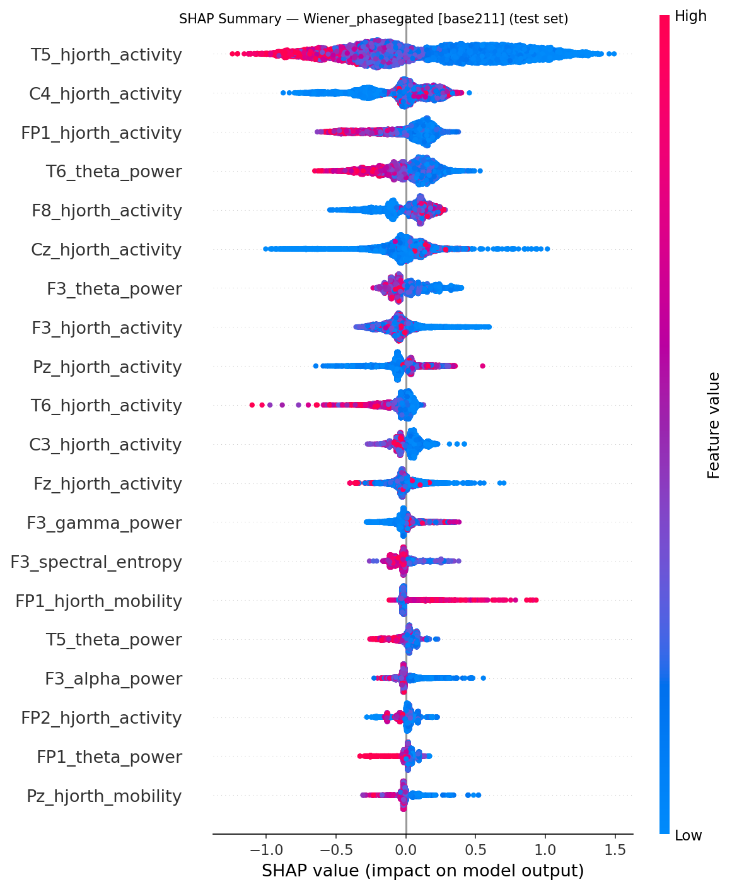
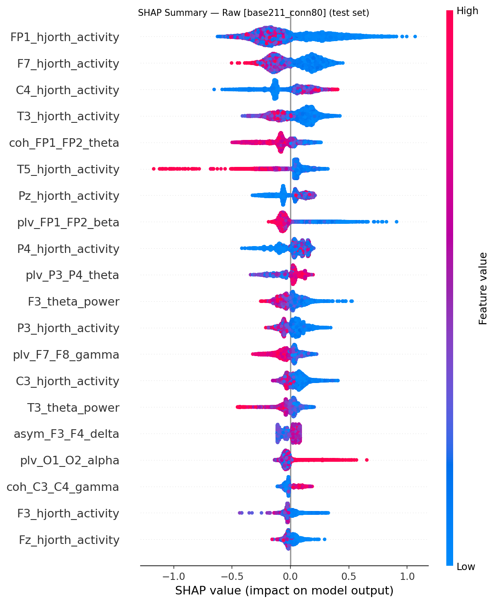
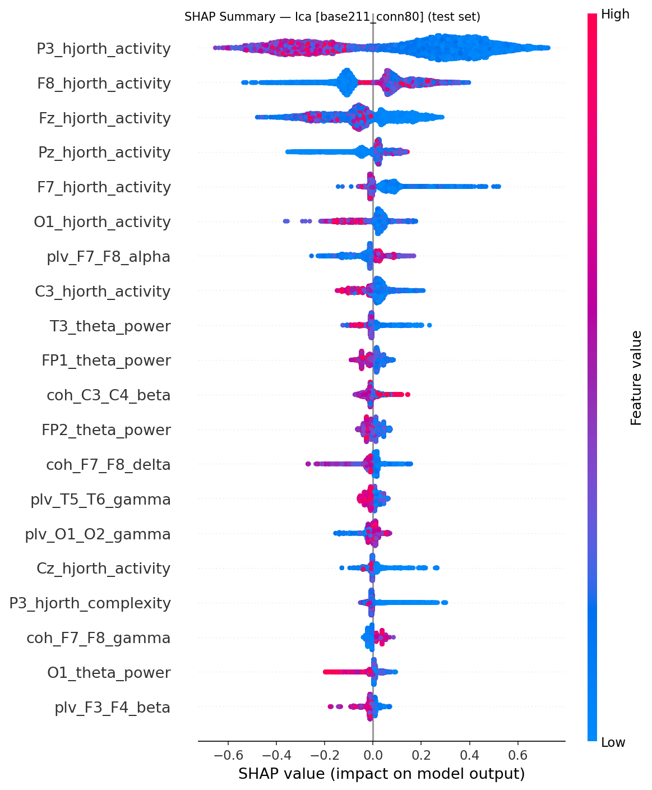
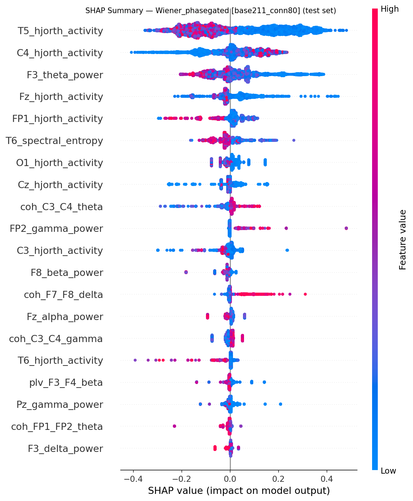

# Experiment: 2026-07-12_171217_exp_wiener_phase_7_wiener-phase-exp7

**Date:** 2026-07-12 17:12:17  
**Config:** configs/exp_wiener_phase_7.yaml  
**Profiles found:** base211, base211_conn80

## Configuration Snapshot

| Parameter | Value |
|---|---|
| `target_sfreq` | 125 |
| `bandpass` | [0.5, 40.0] |
| `epoch_length_sec` | 20.0 |
| `artifact_threshold_uv` | 200.0 |
| `seizure_buffer_sec` | 30.0 |
| `split.train` | 0.7 |
| `split.val` | 0.1 |
| `split.test` | 0.2 |
| `split.random_seed` | 42 |
| `wiener.mode` | phasegated |
| `wiener.nperseg` | 500 |
| `wiener.freq_resolution_hz` | 0.5 |
| `wiener.coherence_threshold` | 0.45 |
| `wiener.overlap_policy` | coherence_weighted |
| `wiener.filter_magnitude_threshold` | 50.0 |
| `wiener.freq_band` | [0.5, 40.0] |
| `wiener.phase_gate_threshold_rad` | 0.3141592653589793 |
| `ica.n_components` | 19 |
| `ica.artifact_corr_threshold` | 0.8 |
| `ml.cv_folds` | 5 |
| `ml.early_stopping_rounds` | 30 |
| `ml.param_grid` | {"max_depth": [3, 4, 5, 6], "learning_rate": [0.01, 0.05, 0.1, 0.3], "n_estimators": [100, 200, 500], "subsample": [0.8, 1.0], "colsample_bytree": [0.8, 1.0], "reg_alpha": [0.0, 0.1], "reg_lambda": [1.0, 5.0]} |
| `ml.features.connectivity.nperseg` | 250 |

## XGBoost Results Summary — `base211`

| Condition | Val AUROC | Val F1 | Val Acc | Test AUROC | Test F1 | Test Acc |
|---|---|---|---|---|---|---|
| raw | 0.583 | 0.588 | 0.588 | 0.759 | 0.699 | 0.703 |
| ica | 0.597 | 0.636 | 0.647 | 0.650 | 0.621 | 0.649 |
| wiener_phasegated | 0.681 | 0.706 | 0.706 | 0.747 | 0.675 | 0.676 |

## XGBoost Results Summary — `base211_conn80`

| Condition | Val AUROC | Val F1 | Val Acc | Test AUROC | Test F1 | Test Acc |
|---|---|---|---|---|---|---|
| raw | 0.597 | 0.646 | 0.647 | 0.785 | 0.679 | 0.703 |
| ica | 0.583 | 0.636 | 0.647 | 0.732 | 0.644 | 0.676 |
| wiener_phasegated | 0.528 | 0.614 | 0.647 | 0.694 | 0.563 | 0.595 |

## Dataset Statistics

| Split | Subjects | Epochs | Epilepsy Subj | Control Subj | Epilepsy Ep | Control Ep |
|---|---|---|---|---|---|---|
| train | 124 | 54592 | 67 | 57 | 43404 | 11188 |
| val | 17 | 2063 | 9 | 8 | 1407 | 656 |
| test | 37 | 9343 | 20 | 17 | 7707 | 1636 |

## Feature Profiles

`base211`, `base211_conn80`

## SHAP Comparison — `base211`

## SHAP Comparison — `base211_conn80`

## Per-Condition SHAP Summaries — `base211`

### Raw

### Ica

### Wiener_phasegated

## Per-Condition SHAP Summaries — `base211_conn80`

### Raw

### Ica

### Wiener_phasegated

