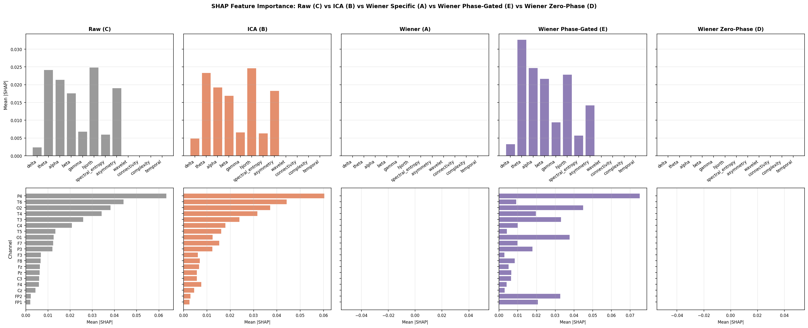
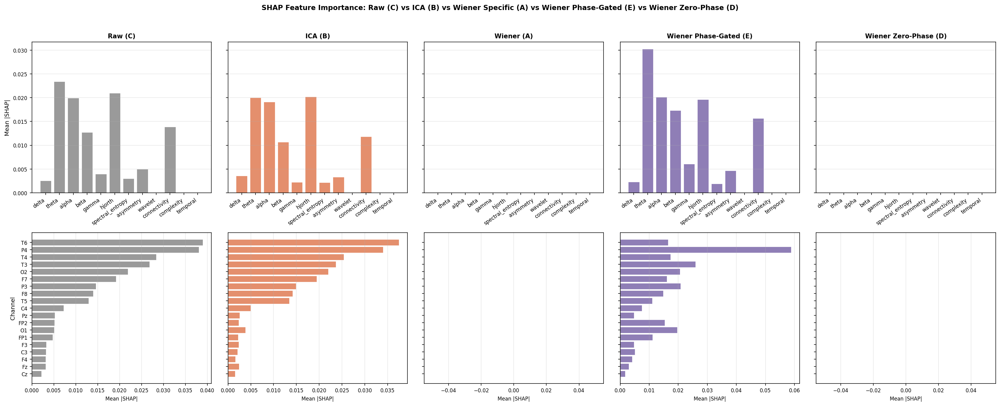
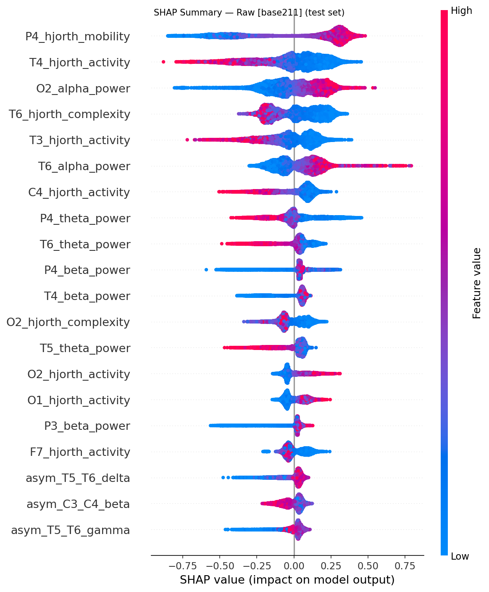
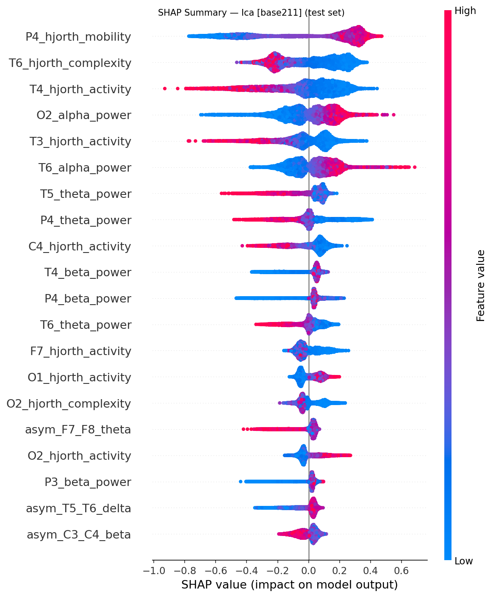
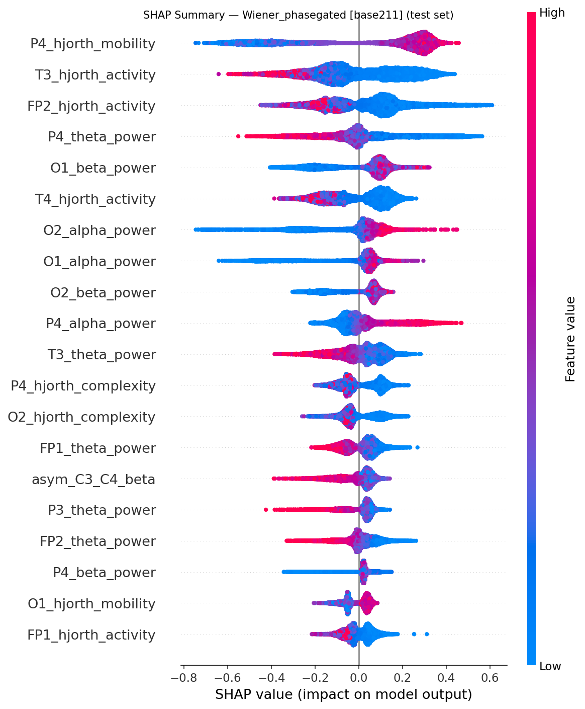
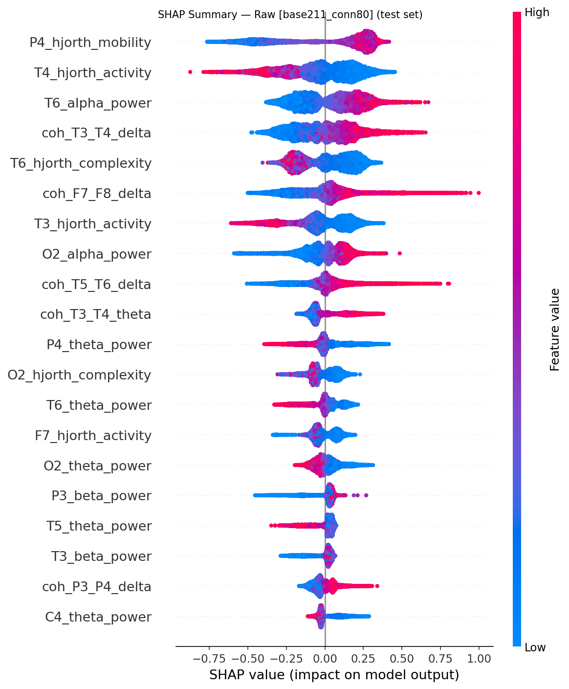
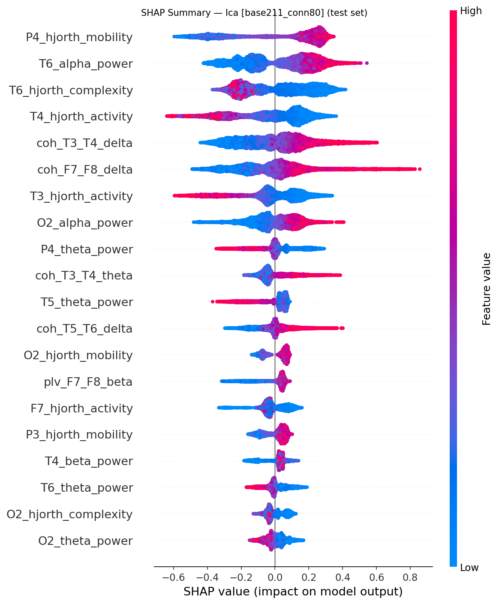
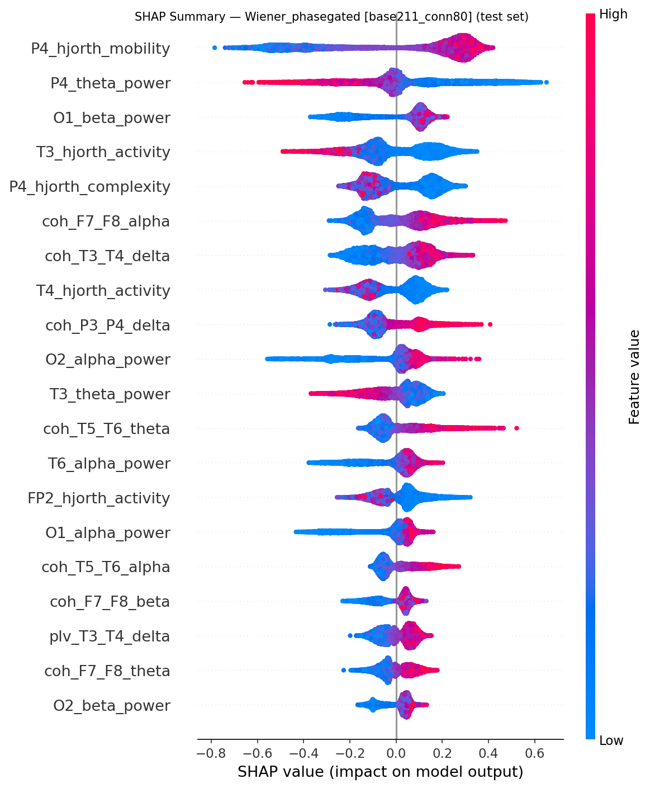

# Experiment: 2026-07-16_024113_exp_tuab_wiener_phase_4_tuab-wiener-phase-exp4

**Date:** 2026-07-16 02:41:13  
**Config:** configs/exp_tuab_wiener_phase_4.yaml  
**Profiles found:** base211, base211_conn80

## Configuration Snapshot

| Parameter | Value |
|---|---|
| `dataset.active` | tuab |
| `dataset.tuab.max_recording_sec` | 1200.0 |
| `dataset.tuab.validation_fraction` | 0.1 |
| `target_sfreq` | 125 |
| `bandpass` | [0.5, 40.0] |
| `epoch_length_sec` | 20.0 |
| `artifact_threshold_uv` | 200.0 |
| `seizure_buffer_sec` | 30.0 |
| `split.train` | 0.7 |
| `split.val` | 0.1 |
| `split.test` | 0.2 |
| `split.random_seed` | 42 |
| `wiener.mode` | phasegated |
| `wiener.nperseg` | 500 |
| `wiener.freq_resolution_hz` | 0.5 |
| `wiener.coherence_threshold` | 0.15 |
| `wiener.overlap_policy` | coherence_weighted |
| `wiener.filter_magnitude_threshold` | 50.0 |
| `wiener.freq_band` | [0.5, 40.0] |
| `wiener.phase_gate_threshold_rad` | 1.5707963267948966 |
| `ica.n_components` | 19 |
| `ica.artifact_corr_threshold` | 0.8 |
| `ml.cv_folds` | 5 |
| `ml.early_stopping_rounds` | 30 |
| `ml.param_grid` | {"max_depth": [3, 4, 5, 6], "learning_rate": [0.01, 0.05, 0.1, 0.3], "n_estimators": [100, 200, 500], "subsample": [0.8, 1.0], "colsample_bytree": [0.8, 1.0], "reg_alpha": [0.0, 0.1], "reg_lambda": [1.0, 5.0]} |
| `ml.features.connectivity.nperseg` | 250 |

## XGBoost Results Summary — `base211`

| Condition | Val AUROC | Val F1 | Val Acc | Test AUROC | Test F1 | Test Acc |
|---|---|---|---|---|---|---|
| raw | 0.901 | 0.862 | 0.863 | 0.911 | 0.826 | 0.829 |
| ica | 0.903 | 0.865 | 0.867 | 0.913 | 0.826 | 0.829 |
| wiener_phasegated | 0.912 | 0.877 | 0.878 | 0.916 | 0.834 | 0.836 |

## XGBoost Results Summary — `base211_conn80`

| Condition | Val AUROC | Val F1 | Val Acc | Test AUROC | Test F1 | Test Acc |
|---|---|---|---|---|---|---|
| raw | 0.924 | 0.863 | 0.863 | 0.920 | 0.810 | 0.811 |
| ica | 0.917 | 0.858 | 0.859 | 0.921 | 0.826 | 0.829 |
| wiener_phasegated | 0.919 | 0.854 | 0.856 | 0.918 | 0.836 | 0.840 |

## Dataset Statistics

Dataset: `tuab`; evaluation unit: `recording`.

| Split | Evaluation units | Patients | Epochs | Abnormal units | Normal units | Abnormal epochs | Normal epochs |
|---|---|---|---|---|---|---|---|
| train | 2428 | 1863 | 129104 | 1194 | 1234 | 62378 | 66726 |
| val | 270 | 207 | 14135 | 133 | 137 | 6836 | 7299 |
| test | 275 | 252 | 14833 | 126 | 149 | 6677 | 8156 |

## Feature Profiles

`base211`, `base211_conn80`

## SHAP Comparison — `base211`

## SHAP Comparison — `base211_conn80`

## Per-Condition SHAP Summaries — `base211`

### Raw

### Ica

### Wiener_phasegated

## Per-Condition SHAP Summaries — `base211_conn80`

### Raw

### Ica

### Wiener_phasegated

